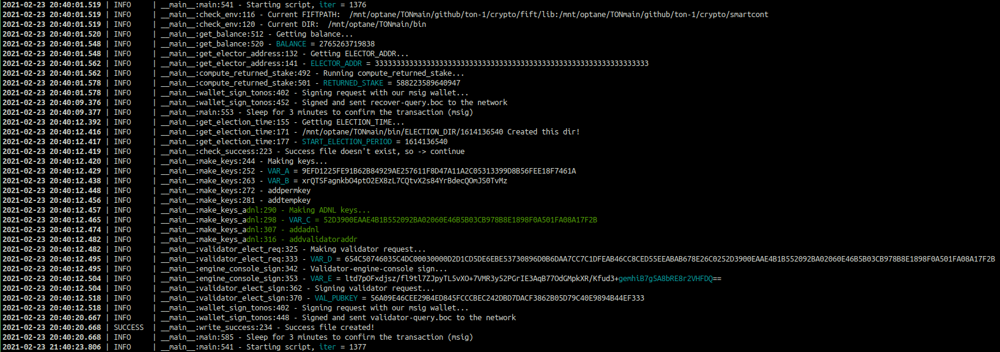

## Small utility to automate validator requests and get rewards
Please refer to [Validator HOWTO Guide](https://test.ton.org/Validator-HOWTO.txt)

#### WARNING! Highly experimental. Use at your own risk!
Tested on Ubuntu 18.04, using [the last commit](https://github.com/ton-blockchain/ton/commit/950e29226425e8f0452d6ecc55c64446f0f77b70).

### Required:

* Python 3 (Tested on 3.6.8)
* working Full-node that completed sync
* configured lite-client and validator-engine-console
* default keys and wallet (as shown in *Validator HOWTO Guide*) stored along with executables
* executables (fift, lite-client, validator-engine-console)
* configured env variable $FIFTPATH
* recover-query.boc which you can obtain by running (`fift -s recover-stake.fif`)
* wallet smart contract in the masterchain (*-1 identifier*)
* sufficient amount of Grams for validation purposes (200k will result in continuous process of validation)


### Installation steps:
```
#set env variable in .bashrc file using export, here user=ton
export FIFTPATH=/home/ton/ton-sources/ton/crypto/fift/lib:/home/ton/ton-sources/ton/crypto/smartcont
export BETTER_EXCEPTIONS=1
sudo apt install python3-pip
sudo apt install python3-venv
python3 -m venv env
if you use bash -> source env/bin/activate
#After that your promt will change
#Place requirements.txt and validator.py in directory with executables
pip install -r requirements.txt
#Run and check the output
python validator.py
#To exit run
deactivate
```
#### How to run:

Place validator.py along with executables and run

***python validator.py***


### Important notes

Backup your node config because the script makes a lot of keys.

We recommend to check the output and the source code.

As seqno of your wallet smartcontracts changes - old *.boc* files are useless, so we don't keep them.

If everything is OK, these files will be periodically overwritten:
- return-stake.boc
- validator-to-sign.bin
- validator-query.boc
- finish.boc


#### Current dir listing before running the script:


#### Running the script:



#### Current dir listing after running the script:


#### Notes on automation

Run the script with *watch* for a couple of hours to test it:

`(env) ton@server /m/o/T/b/950e2> watch -n 180 -d "python validator.py"`

When you have checked everything you can proceed and configure running the script with cron:

`*/3 * * * * cd /path/to/DIR && env/bin/python validator.py > /dev/null 2>&1`

Refer to a good article about [cron and python](https://monicagranbois.com/blog/python/cron-and-python-virtualenv/).

#### Logs 

Script logs the results of its works to **last.log** file and to separate directories regarding anything about current elections.

Also, it stores stats and keys in DB file.

#### DB file

The db file is a json generated by [TinyDB](https://github.com/msiemens/tinydb).

You can parse it by running  `cat db.json | jq -r '._default' | jq '[.[]]'`  to get output ready to make some charts.
